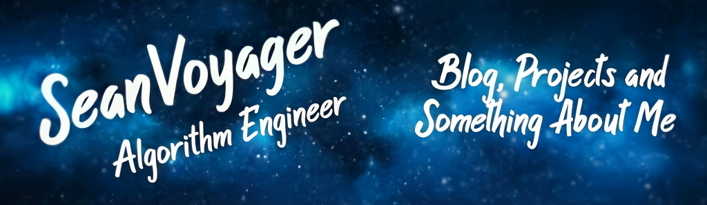

  

<h2 align="center">👋 Hello! I'm SeanVoyager </h2>

   
  &nbsp;
  &nbsp;

---
### **About Me:**

AI Engineer dedicated to translating academic research into scalable solutions for industrial automation and real-world applications .

AI Engineer. Currently transforming cutting-edge research into production-ready solutions for industrial automation and multimodal understanding.
人工智能工程师。目前正致力于将前沿研究转化为面向工业自动化与多模态理解的生产级解决方案。

---

